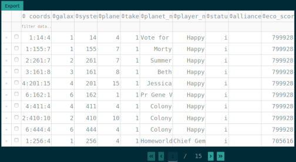

# ogame raid radar

a python dash app to visualize inactive players in a universe for https://ogame.org  

---

## Demo
 Get an interactive plot with all inanctive players on a server and get highlight the ones
 near to your departure planet.


Look through the list and find the most lucrative ones (highest economy score). 
Get all values as a `csv` file by hitting the `export` button



## usage
The app can be used after the  usual steps of 
 - getting the code, 
 - creating a virtualenv and activating it to protect your system python version,
 - installing the required third party packages and
 - finally starting the app

```bash
git clone <adress of raid radar repo > <target>
cd raidradar
virtualenv -p python3.7 venv
. ./venv/bin/activate
pip install -r requirements.txt 
python raidradar.py
```

## How is it done?
First forget about Newton, heliocentric view, or physics in general. The idea here is to get a visualisation logic.
So:
 - All `planets` exist around a fictional `center of the universe (x = 0, y = 0)`.
 - The distance of a planet from the core of the universe represents its solar system position in the game. 
 - The `galaxy` and `solar system` are represented by an angle. much like second relate to minute on a regular analog clock.
 

Here is the math behind it:
```
z = r * e^(i * phi)

phi = f(galaxy, system) = (galaxy - 1) * galaxy_increment + (system - 1) *  system_increment + shift_to_yaxis
x = Re(z)
y = Im(z)
z = x + iy
z = r(cos(phi) + i * sin(phi))
```
`galaxy_increment` and `system_increment` depend on the galaxies in the universe and systems in a galaxy.
Essentially these constants are just there to ensure that our planets are spread equally and only between `0` in `2pi` (pi like 3.1415)

The plot would start at `y = 0` (representing 1:1:1) and continue counter clockwise. 
That is why `shift_to_yaxis` is introduced into calculation of `phi`. 
Now the plot starts at `x = 0` but still continues counter clockwise.

Usually `r` would be calculated:

```
r = |z| = sqrt(x^2 + y^2)
```
In that scenario r would form the classic spiral form. Not what we want.
Instead we set `r = 1` - for now - and get our preliminary `x` and `y` values
```
r = 1 
x = Re(z) = cos(phi)
y = Im(z) = sin(phi)
```

Okay, `galaxies` and the `solar system` are represented by an angle `phi`
We could use `r` to represent the `slot` in the `solar system` such that
`slot = 5` would translates to fifth planet in the respective `solar system`.
An empirical constant `minimum_distance` and `planet_increment` is set to ensure 
that all elements are spread out across the plot (i.e. planets) can be plotted.

```
r(planet_slot) = f(planet_slot) = planet_increment * planet_slot + minimum_distance
```

The final ready to coordinates for cartesian plot can than be obtained with:

```
x = r(planet_slot) * cos(phi(galaxy, system))
y = r(planet_slot) * sin(phi(galaxy, system))
```

The plot is running counter clockwise which non intuitive.
To match it with an intuitive clock pattern **the `xaxis` is reversed**.


> Note We never actually touched complex numbers but borrowed the concept of 
> the complex plain to visualize complex numbers!

## Constraints
1. I created this app mostly for my self to learn more about dash table elements.
   Note that the project uses a global variable `UNIVERSE_FIGURE`. That means that the app will break 
   with multiple users.
   
   It's possible to have multiple users by using a session caches see (https://dash.plotly.com/sharing-data-between-callbacks).

2. The universe to plot is hardcoded (`universe_id=162, community='en'`). `dcc.Location` could be used to route 
   to an app for each universe running on the `ogame` servers. But the global `UNIVERSE_FIGURE` needs to be removed
   to achieve that. 

3. To reduce `http` calls I used `requests_cache`. You could remove the initialisation of it, 
   or set an expiry matching the update frequencies of the XML files.


## Resources

https://paletton.com to get excellent color suggestions to match the CSS theme which is already optimized by great people.

https://github.com/oxalorg/sakura for a drop in css

https://github.com/erkandem/ogame-stats client package for ogame game statistics
