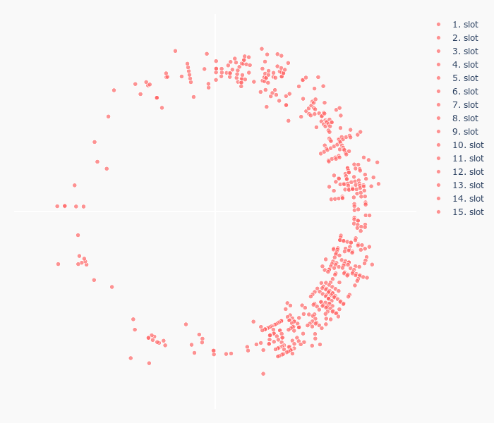

How is it done?
 - all `planets` rotate around a fictional `center of universe (x=0,y=0)`
 - the distance of a planet from the core represents it's solar system position
 - `galaxies` and `solar system` are defined by an angle starting from `x=0` i.g. 12 o'clock
 - `x` and `y` are calculated similar/same as complex numbers
 
```
z = e^(i\phi)
phi = (galaxy - 1) * \delta_galaxy + (system - 1) system_increment + shift_to_yaxis

```

```latex
shift\_to\_yaxis = \pi / 2 \\
\delta_{galaxy} = (2 \cdot  \pi) / 9 = const \\
\delta_{system} = \delta_{galaxy} / 499 = const \\
minimum\_distance = 1 = const \\
```

the planets start at `x=0`. To match a clock pattern a constant is added to  `phi` 
 - `shift_to_yaxis` is set to `pi / 2` (i.e. 90° counter clockwise)

```latex
z = r \cdot e^{i\phi} \\

\phi = f(galaxy, system) = (galaxy - 1) \cdot  \delta_{galaxy} + (system - 1) \cdot  \delta_{system} + shift\_to\_yaxis \\

x = Re(z) \\
y = Im(z) \\
z = x + iy \\
z = r(\cos(\phi) + i \cdot \sin(\phi)) \\

```
usually `r` would be calculated:
```
r = |z| = sqrt{x^2 + y^2}
```

instead we set r to 1 and get our preliminary `x` and `y` values
```
r == 1 \\
x = \cos(\phi)
y = \sin(\phi)
```

adjusting the radius `r` to represent the slot in the `solar system`  

```tex
r = f(x) = \delta_{planet} \cdot  x + minimum\_distance \\
```

final coordinates ready to be plotted

```tex
x = x \cdot r \\
y = y \dot r \\
```

The graph is running counter clockwise which is as expected.
To match it one more step with a clock pattern:
 - the `xaxis` is reversed  
 